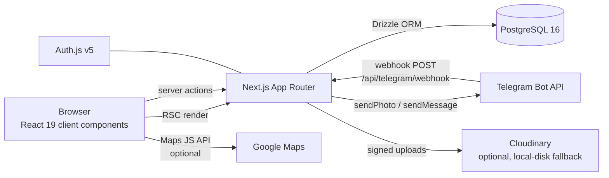

# Architecture

How Tesajor is put together, written from the code as it exists today.
For the original product plan and domain rules, see [`CLAUDE.md`](../CLAUDE.md);
for setup, see the [README](../README.md); for per-action/per-table detail,
see [REFERENCE.md](./REFERENCE.md).

## System overview

Tesajor is a single Next.js 15 (App Router) application. Pages are React
Server Components that read from Postgres via Drizzle; all writes go through
server actions. There is no separate backend service.



External surfaces:

| Surface | Path | Notes |
|---|---|---|
| Auth.js | `src/app/api/auth/[...nextauth]/route.ts` | Credentials (bcrypt) + Google OAuth, Drizzle adapter |
| CSV export | `src/app/api/groups/[id]/export/route.ts` | Member-gated download of a group's expenses |
| Telegram webhook | `src/app/api/telegram/webhook/route.ts` | Secret-token verified; handles deep-link account linking and "I've paid" callbacks |
| Uploads | `src/app/api/uploads/route.ts` | Validated (type/size/magic bytes), compressed client-side first; Cloudinary or `public/uploads/` fallback |

## Layering rule (the one rule that matters)

**Domain math lives in pure, framework-free modules under `src/lib/`, and
server actions are the only write path.** Client components never compute
money amounts, XP, or permissions authoritatively — they display what the
server returns. Every server action parses its input with a Zod schema from
`src/lib/validation/` before touching the database.

```
src/
  app/          routes (RSC pages, layouts, API route handlers)
  components/   feature components + components/ui (shadcn primitives)
  db/           schema.ts (Drizzle, 28 tables / 7 enums), index.ts, seed.ts
  i18n/         next-intl config (locales: en, km)
  lib/
    actions/    18 server-action files — the ONLY mutation entry points
    validation/ Zod schemas, one file per action domain
    queries/    read-side helpers (balances, trip achievements, trending places)
    money/      cents math, USD↔KHR conversion, currency formatting
    splits/     expense splitting: equal | exact | percent | shares | itemized
    balances/   net balances + greedy debt simplification
    quests/     trip gamification: XP, progress, achievement rules
    trips/      trip permissions, template cloning, geo helpers
    geo/        Cambodian province detection (bundled OSM-derived polygons)
    places/     Overpass essentials search, cache cells, trending ranking
    music/      Subsonic (Navidrome) client + province→playlist suggestion
    routing/    road routes (OpenRouteService) + Follow-mode geometry
    voice/      TTS phrases/providers + arrival debounce (Khmer companion)
    telegram/   HMAC verify, webhook parsing, per-debtor amounts, bot client
    upload/     client-side image compression
    auth.ts     Auth.js config · rate-limit.ts · cloudinary.ts
```

## Domain modules

- **`money/`** — `cents.ts` (integer-cents arithmetic, parsing, deterministic
  remainder distribution), `convert.ts` + `exchange-rate.ts` (USD↔KHR
  conversion; groups and trips carry an optional `usd_khr_rate` override,
  falling back to `DEFAULT_USD_TO_KHR_RATE`), `currency.ts` (display
  formatting via `Intl.NumberFormat`). **All money is integer minor units;
  floats are never used for money.**
- **`splits/`** — `calculate.ts` turns `(total, method, inputs)` into
  per-member `owedAmountCents`. Itemized mode assigns line items to one or
  more members and splits tax/tip proportionally to each member's item
  subtotal. Rounding remainders go to the earliest members in a stable sort
  so `Σ owed === total` always holds.
- **`balances/`** — `calculate.ts` computes
  `net = paid − owed − settlementsSent + settlementsReceived` per member
  (nets always sum to 0), then greedy min-cash-flow matching (largest debtor
  vs. largest creditor) yields ≤ n−1 suggested settlements.
- **`quests/`** — `xp.ts`, `progress.ts`, `achievements.ts`. XP is always
  derived server-side from completion/achievement counts — never accepted
  from the client.
- **`trips/`** — `permissions.ts` (owner/editor/viewer capability checks),
  `clone.ts` (template cloning: copies structure, shifts dates to the new
  start date, strips journals, records `cloned_from_trip_id`), `geo.ts`
  (haversine distance, nearest-upcoming-stop, universal Google Maps
  directions URL — the latter two need no API key).
- **`geo/`** — `provinces.ts`: `provinceForPoint(lat, lng)` over bundled,
  simplified geoBoundaries KHM ADM1 polygons (`provinces-data.ts`,
  OSM-derived, ODbL — "© OpenStreetMap contributors" credited in the app
  footer). Ray-casting point-in-polygon with hole support (Phnom Penh is a
  hole in Kandal) and a 2 km border-sliver snap; returns en + km province
  names, null outside Cambodia.
- **`places/`** — `overpass.ts` (pure Overpass QL builder + response
  normalizer for the essentials categories, thin fetcher), `cache-cell.ts`
  (~0.02° grid keys for `place_cache`), `trending.ts` (distinct-trip count
  with recency decay over public-template agenda items; hides places below
  3 distinct trips). See ADR-0007.
- **`music/`** — `subsonic.ts` (pure Subsonic URL/param construction and
  response parsing, thin fetchers; auth pair is salt + md5 token, never a
  password — ADR-0008), `suggest.ts` (playlist-for-province: explicit
  mapping → km/en name match → null; dominant province of a day's stops).
  Audio streams directly from the user's server to their device.
- **`routing/`** — `ors.ts` (provider-neutral `Route` shape, pure
  OpenRouteService request/response handling, ~10 m cache-key rounding,
  thin fetcher; optional `OPENROUTESERVICE_API_KEY`, unset → straight
  polylines — ADR-0009), `follow.ts` (nearest-point-on-polyline, remaining
  distance, ETA, 200 m off-route detection for Follow mode).
- **`voice/`** — `phrases.ts` (welcome/reminder text from message-file
  templates + content hash), `tts.ts` (Azure/Google Khmer TTS behind one
  interface, env-selected, both optional — ADR-0010), `arrival.ts` (pure
  100 m / 10 s dwell state machine feeding the arrival welcome). Clips are
  pre-generated server-side and cached in `voice_clips`; the client
  degrades clip → on-device speech → chime + banner.
- **`telegram/`** — `verify.ts` (Login Widget HMAC-SHA256 check with the bot
  token, stale `auth_date` rejection), `webhook.ts` (pure update→intent
  parsing), `amounts.ts` (per-debtor amounts from simplified balances),
  `client.ts` (thin Bot API wrapper, the only impure file). The "I've paid"
  button creates a *pending claim*; only the requester's in-app confirmation
  records a real settlement.

Each of these has a co-located `*.test.ts` (26 files, 255 cases). This is
deliberate: the pure modules are the product; the UI is replaceable.

## Data model

All 28 tables live in `src/db/schema.ts`; migrations are generated SQL in
`drizzle/`. Grouped by domain:

| Domain | Tables |
|---|---|
| Identity & auth | `users`, `accounts`, `sessions`, `verification_tokens` (Auth.js adapter) |
| Groups & expenses | `groups`, `group_members`, `expenses`, `expense_payers`, `expense_shares`, `expense_items`, `item_assignees` |
| Settlement & audit | `settlements`, `activity_log` |
| Telegram | `telegram_accounts`, `telegram_link_tokens`, `payment_methods`, `payment_requests` |
| Trips | `trips`, `trip_members`, `agenda_items`, `item_notes`, `achievements` |
| Places (Explore) | `place_cache` (cached Overpass results per grid cell + category, 7-day TTL at read time) |
| Music | `music_accounts` (Subsonic salt+token, never passwords — ADR-0008), `province_playlists` (explicit province→playlist choices) |
| Routing | `route_cache` (road legs keyed on ~10 m-rounded coords + profile, no TTL — ADR-0009) |
| Voice | `voice_clips` (pre-generated TTS audio per stop/kind/locale/text-hash — ADR-0010), `voice_reminder_sends` (cron idempotency) |

Design points worth knowing before touching the schema:

- `group_members.user_id` is **nullable** — placeholder members exist before
  the person has an account and can claim their spot via invite link. Money
  tables reference `group_members.id`, not `users.id`, for exactly this
  reason.
- Expenses are **soft-deleted** (`deleted_at`) and every mutation writes an
  `activity_log` row.
- `payment_requests` separates `paid_at` (debtor tapped "I've paid") from
  `confirmed_at` + `settlement_id` (requester confirmed; only now do
  balances change).
- `trips.invite_code` (collaborator joining) is distinct from
  `trips.visibility` (template cloning: `private | link | public_template`).

### Invariants (enforced in code, asserted in tests)

1. `Σ expense_payers.paid_amount_cents === expenses.total_amount_cents`
2. `Σ expense_shares.owed_amount_cents === expenses.total_amount_cents`
3. Rounding remainders are distributed deterministically so 1–2 always hold.
4. Group balance nets sum to exactly 0.
5. Debt simplification produces at most n−1 transactions.

If a change can violate one of these, it needs a test in the corresponding
`src/lib/**/**.test.ts` before it merges.

## Cross-cutting concerns

- **Auth** — Auth.js v5 (`src/lib/auth.ts`): Credentials (bcryptjs) +
  optional Google OAuth, sessions via the Drizzle adapter. Telegram can be
  linked to an account two ways: the Login Widget (HMAC-verified) or a
  `t.me/<bot>?start=<one-time-token>` deep link consumed by the webhook
  (which is also how the bot captures `chat_id`).
- **Authorization** — helpers in `src/lib/actions/group-membership.ts`
  (`requireUserIsMember`, `requireGroupMemberIds`) and
  `trip-membership.ts` (`getTripRole`) gate every action; trip capabilities
  come from `src/lib/trips/permissions.ts`.
- **i18n** — `next-intl` with English and Khmer (`messages/en.json`,
  `messages/km.json`). Every user-facing string goes through translations;
  a `setLocale` server action persists the choice. The bi-currency
  (USD/KHR) support in `money/` exists for the same Cambodian-market reason.
- **Rate limiting** — `src/lib/rate-limit.ts`: in-memory fixed-window
  limiter, active only in production, per server process. Adequate for a
  single instance; must move to Redis/Upstash before scaling to multiple
  instances (see [SCALING.md](./SCALING.md)).
- **Uploads** — images are compressed in the browser
  (`src/lib/upload/compress-image-client.ts`), validated server-side
  (type/size/magic bytes, `src/lib/validation/upload-path.ts`), then stored
  on Cloudinary when the three env vars are set, else `public/uploads/`.
- **Config** — all external services are optional and degrade gracefully:
  no Telegram token → buttons explain it's not configured; no Maps key →
  plain stop list instead of embedded map; no Cloudinary → local disk.
  `.env.example` documents every variable and its fallback.

## Testing strategy

- **Unit (Vitest)**: pure `src/lib/` modules only, co-located tests,
  `pnpm test`. This is where correctness lives.
- **E2E (Playwright)**: `e2e/` — smoke, trip journey, currency conversion,
  feature toggles. Mobile Chrome (Pixel 5) profile, single worker (the
  rate limiter shares buckets across tests), auto-starts `pnpm dev`.
- **Known gap**: server actions, route handlers, and components have no
  direct tests — tracked in [ROADMAP.md](./ROADMAP.md).
